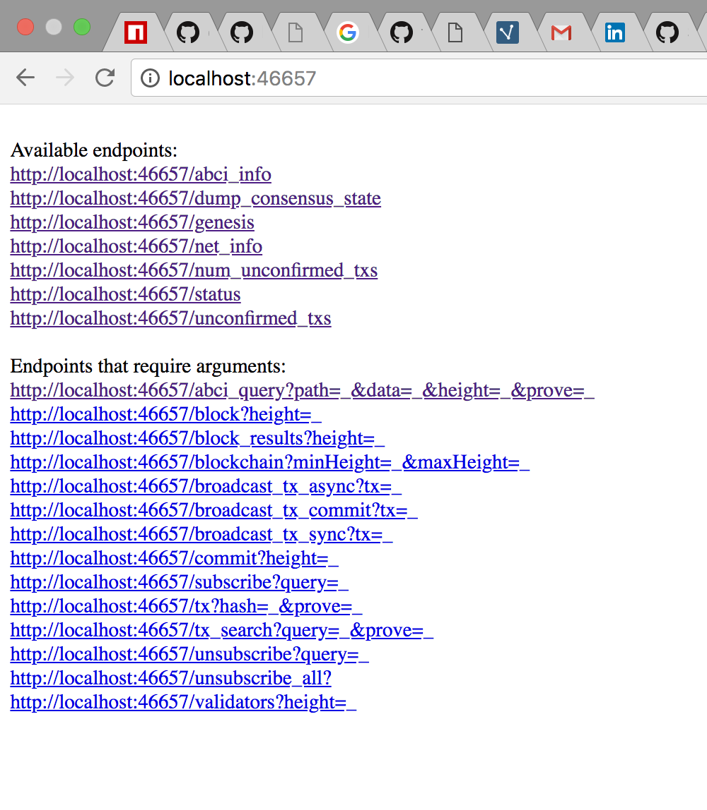
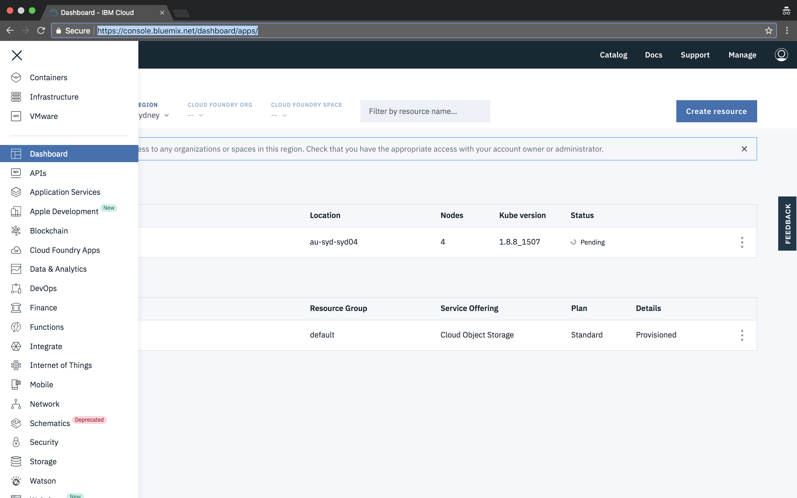
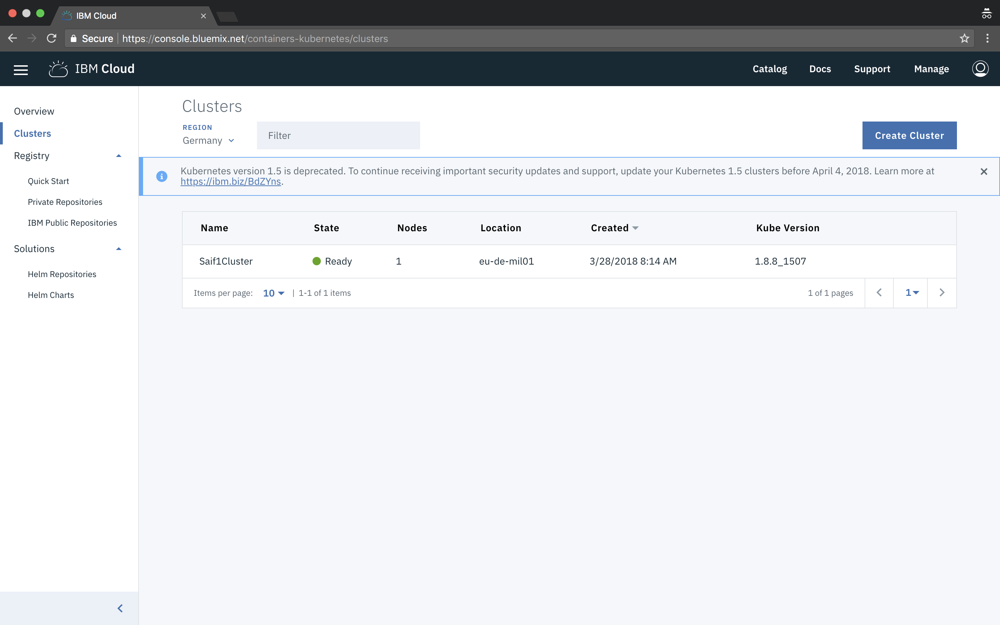
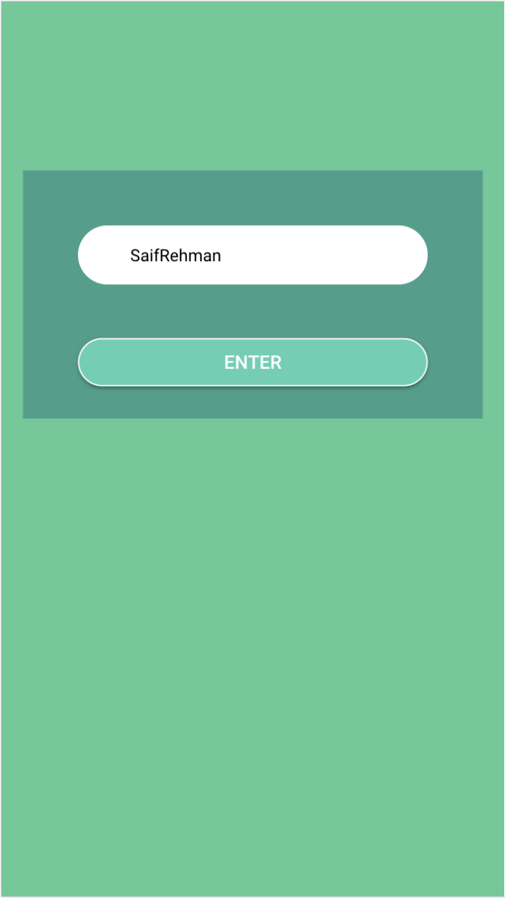
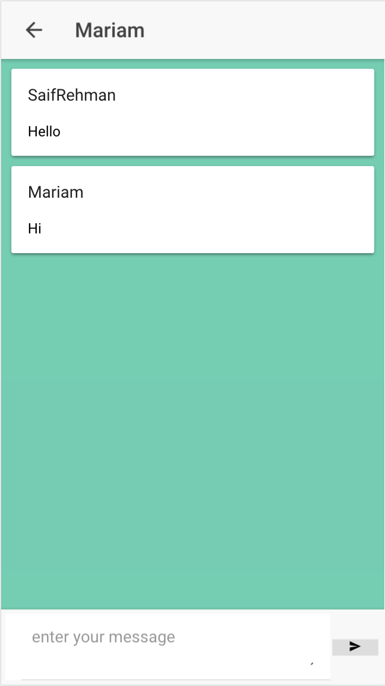

<h1 align="center">
  <br>
  <a href="https://github.com/SaifRehman/tendermint-chat-app"></a>
  <br>
      Blockchain Chat App
  <br>
  <br>
</h1>

<h4 align="center">Blockchain Chat App with Tendermint  ✨ Lotion ✨  and IBM Cloud</h4>

<p align="center">
  <a>
    
  </a>
</p>
<br>

Table of Contents
=================

   * [Running the Blockchain locally](#running-the-blockchain-locally)
   * [Deploying 2 validators to IBM Cloud](#deploying-two-validator-nodes-on-ibm-cloud)
   * [Tendermint Api Documentation](#tendermint-api-documentation-of-cloud-foundry-app)


## Contributors

| [<br /><sub><b>SaifRehman</b></sub>](https://www.linkedin.com/in/saif-ur-rehman/)<br />[💻](https://github.com/SaifRehman/watsonic/commits?author=SaifRehman "Code") [📖](https://github.com/SaifRehman/tendermint-chat-app/commits?author=SaifRehman "Documentation") [🤔](#ideas-keppel "Ideas, Planning, & Feedback") [⚠️](https://github.com/SaifRehman/tendermint-chat-app/commits?author=SaifRehman "Tests") | [<br /><sub><b>Jacob Gadikian</b></sub>](https://www.linkedin.com/in/jacobgadikian/)<br />[💻](https://github.com/SaifRehman/tendermint-chat-app/commits?author=faddat "Code") [🤔](#ideas-mappum "Ideas, Planning, & Feedback") [⚠️](https://github.com/SaifRehman/tendermint-chat-app/commits?author=sudoalgorithm "Tests") [🔌](#plugin-mappum "Plugin/utility libraries")| [<br /><sub><b>Kunal Malhotra</b></sub>](https://www.linkedin.com/in/knrmalhotra/)<br />[💻](https://github.com/SaifRehman/tendermint-chat-app/commits?author=sudoalgorithm "Code") [🤔](#ideas-mappum "Ideas, Planning, & Feedback") [⚠️](https://github.com/SaifRehman/tendermint-chat-app/commits?author=sudoalgorithm "Tests") [🔌](#plugin-mappum "Plugin/utility libraries")
| :---: | :---: | :---: |
## Tendermint Blockchain Chat App


This is minimal chat application based on Tendermint Consensus Engine using Lotionjs. It also includes web/mobile application built using Ionic 3.

### Creating Genesis file with 2 validators

1. Navigate to creatingGenesisFile directory
``` $ cd creatingGenesisFile ```
2. Install dependencies
``` $ npm i ```
3. How Genesis file looks currently with no validators
``` JSON
{
    "genesis_time": "0001-01-01T00:00:00Z",
    "chain_id": "name",
    "validators": [
    ],
    "app_hash": ""
}
```
4. Generate 2 validators
```
$ ./node_modules/lotion/bin/tendermint gen_validator > privkey0.json
$ ./node_modules/lotion/bin/tendermint gen_validator > privkey1.json
```
5. How private key looks like, it has public and private key randomly generated
```JSON
{
	"address": "B809574EC51377DE48454094BF3302989CBB50A9",
	"pub_key": {
		"type": "ed25519",
		"data": "8A049817BA6D1B065C30D927A529AAFA7147BE0D147E1CCD7A25FAADBE80C8D0"
	},
	"priv_key": {
		"type": "ed25519",
		"data": "57BAFDD6136E1140FA9F906313BF2CFC75802F044704DD7AAF30BC1010E6519C8A049817BA6D1B065C30D927A529AAFA7147BE0D147E1CCD7A25FAADBE80C8D0"
	}
}
```

6. Copy only public key information and paste in genesis.json, this how it will look like in the end after adduing two validators
```JSON
{
    "genesis_time": "0001-01-01T00:00:00Z",
    "chain_id": "name",
    "validators": [
        {
            "pub_key": {
                "type": "ed25519",
                "data": "8A049817BA6D1B065C30D927A529AAFA7147BE0D147E1CCD7A25FAADBE80C8D0"
            },
            "power": 10,
            "name": "saif"
        },
        {
            "pub_key": {
                "type": "ed25519",
                "data": "5FD1FBF59759E50BD1C23911E832198AB78A4F7E6F1F23A64AAFEC5992608CA8"
            },
            "power": 20,
            "name": "prerna"
        }
    ],
    "app_hash": ""
}
```
* You add Power and Name of validators as well 

### Running the Blockchain locally
1. Navigate to localnode dir 
```
$ cd localnode
```
2. Install dependencies 
```
$ npm i 
```
3. Run the Blockchain
```
$ node node1.js
```
4. Open ```frontend/src/pages/congif/config.ts``` , and set to ```localhost:8080```
```TypeScript
export class config {
    public static baseUrl = "http://localhost:8080";
    public  constructor() {
    }
}
```
5. Spin up frontend buid in ionic to communicate with the Blockchain
```
$ npm i -g ionic cordova
$ cd frontend
$ ionic serve
```


### Examples

#### Minimum code to run lotion as one node
```JavaScript
let lotion = require('lotion')
let app = lotion({
  tendermintPort: 46657,
  initialState: { messages: [] },
  logTendermint: true,
})
app.use((state, tx,chainInfo) => {
  if (typeof tx.sender === 'string' && typeof tx.message === 'string') {
    state.messages.push({ sender: tx.sender, message: tx.message })
  }
})
app.listen(3000).then(({ GCI }) => {
  console.log(GCI)
})
```
Your tendermint port is 46667
1. Endpoint: http://localhost:3000/state (GET), shows current data in blockchain
2. Endpoint: http://localhost:3000/txs (POST), post new data in blockchain
3. Endpoint: http://localhost:46657/ , access available Apis provided by Tendermint RPC 



* End points available through ABCI (Application blockchain interface) :)

#### Running 2 Validators 

* Node1
```JavaScript
require('dotenv').config({path: ".env-node1"});
let lotion = require('lotion')
let app = lotion({
  genesis: './genesis.json',
  tendermintPort: 30090,
  initialState: { messages: [] },
  p2pPort: 30092,
  logTendermint: true,
  keys: 'privkey0.json',
  peers: ['ip:peerport']
})
app.use((state, tx,chainInfo) => {
  if (typeof tx.sender === 'string' && typeof tx.message === 'string') {
    state.messages.push({ sender: tx.sender, message: tx.message })
  }
})
app.listen(3000).then(({ GCI }) => {
  console.log(GCI)
})
```

* Node 2
```JavaScript
require('dotenv').config({path: ".env-node2"});
let lotion = require('lotion')
let app = lotion({
  genesis: './genesis.json',
  tendermintPort: 30090,
  initialState: { messages: [] },
  p2pPort: 30092,
  logTendermint: true,
  keys: 'privkey1.json',
  peers: ['ip:peerport']
})
app.use((state, tx,chainInfo) => {
  if (typeof tx.sender === 'string' && typeof tx.message === 'string') {
    state.messages.push({ sender: tx.sender, message: tx.message })
  }
})
app.listen(3000).then(({ GCI }) => {
  console.log(GCI)
})
```
* To send txs locally through genesis file
```JavaScript
let { connect } = require('lotion')
async function main() {
  let { send } = await connect(null, { genesis: require('./genesis.json'),
   nodes: [ip:tendermintport] })
  console.log(await send({ sender: 'sendername', message: 'message' }))
  process.exit();
}
main()
```

* Getting current state of the Blockchain

```JavaScript
let { connect } = require('lotion')
async function main() {
  let { state } = await connect(null, { genesis: require('./genesis.json'),
   nodes: [ip:tendermintport] })
  console.log(await state.message)
  process.exit();
}
main()
```

How simple can that be?

### Deploying two validator nodes on IBM Cloud
1. Signup to [IBM Cloud](http://ibm.biz/ioblockchain)
2. Install [Cloud Foundry CLI](https://docs.cloudfoundry.org/cf-cli/install-go-cli.html)
3. Install [Bluemix CLI](https://console.bluemix.net/docs/cli/reference/bluemix_cli/get_started.html#getting-started)
4. Install [Kubernetes CLI](https://kubernetes.io/docs/user-guide/prereqs/)

5. Navigate to node1 directory 
```
$ cd node1
```
6. build docker image
``` 
$ docker build -t node1 .
```
7. Go to [IBM Cloud console](https://console.bluemix.net/dashboard/apps/)
8. Navigate to containers


9. Click on create new cluster


10. Name your cluster and create a cluster, wiat for few minutes to get it fully deployed. After it is fully deployed click on the cluster

 
* This shows overview of your deployed cluster 
11. Click on Access tab and follow the instruction on the website
12. Install the container service plugin.
```
$ bx plugin install container-service -r Bluemix
```
13. Log in to your IBM Cloud account.
```
$ bx login -a https://api.eu-de.bluemix.net
$ bx cs region-set eu-central
```
14. Set the context for the cluster in in your CLI.
* Get the command to set the environment variable and download the Kubernetes configuration files.
```
$ bx cs cluster-config NameOfYourCluster
```
* Set the KUBECONFIG environment variable. Copy the output from the previous command and paste it in your terminal. The command output should look similar to the following.
15.  Verify that you can connect to your cluster by listing your worker nodes
```
$  kubectl get nodes
```
16. Go to your [IBM Cloud Registery](https://console.bluemix.net/containers-kubernetes/registry/private)
17. Choose a name for your first namespace, and create that namespace.
```
$ bx cr namespace-add <my_namespace>
```
18. Log your local Docker daemon into the IBM Cloud Container Registry.
```
$ bx cr login
```
19. Choose a repository and tag by which you can identify the image. Use the same repository and tag for the rest of this Quick Start.
```
$ docker tag node1 <registery>/<my_namespace>/node1:latest
```
20. Push the image.
```
$ docker push <registery>/<my_namespace>/node1:latest
```
21. Verify that your image is in your private registry.
```
$ bx cr image-list
```
22. Now your container is deployed on IBM Container, it is time to spin up some pods using kubernetes
* Change image name accordinglly from private name of your registry, just copy/paste :)
```YAML
apiVersion: extensions/v1beta1
kind: Deployment
metadata:
 name: tendermintnodeone # give any name
spec:
 replicas: 1
 template:
   metadata:
     name: tendermintnodeone
     labels:
       run: tendermint1
   spec:
     containers:
       - name: saif1cluster
         image: "<registery>/<my_namespace>/node1:latest" # your registery name
         imagePullPolicy: Always
---
apiVersion: v1
kind: Service
metadata:
 name: my-service-tendermint-11 # give a service name
 labels:
   run: tendermint1
spec:
 type: NodePort
 selector:
   run: tendermint1
 ports:
  - protocol: TCP
    name: tendermint1
    port: 30090  
    nodePort: 30090 
  - protocol: TCP
    name: port
    port: 30092  
    nodePort: 30092 
```
23. Configure Kubernetes, to create pods, services, and deployments
```
$ kubectl create -f service-deployment.yml
```
24. delete all deployments
```
$ kubectl delete deployments --all 
```
25. delete all services
```
$ kubectl delete services --all 
```
26. Follow same procesdure with node2 with dofferent name
27. Access pods and logs
```
$ kubectl get pods
$ kubectl logs podname
```
### Cook a sexy frontend (Using Ionic <3) and connect with validators to send txs to Blockchain
1. Install Ionic
```
$ npm i -g ionic cordova
```
2. Open ```manifest.yml``` and give app a name from ```cf/manifest.yml```
3. Open ```frontend/src/pages/congif/config.ts``` , and give app name you mentioned in manifest.yml
```TypeScript
export class config {
    public static baseUrl = "http://<appname>.mybluemix.net";
    public  constructor() {
    }
}
```
4. Navigate to ```frontend``` directory and build the app
```
$ ionic cordova platform rm browser
$ ionic cordova platform add browser
$ ionic cordova build browser
```
5. Navigate to ```frontend/platforms/browser```. Copy ```www``` folder and paste in ```cf``` folder
6. Navigate to ```cf``` folder, and push the app, this will have a fully functional Blockchain with a sexy frontend build with ionic <3
```
$ cf push
```

### Tendermint Api Documentation of Cloud Foundry App
| Endpoint      | Type          | Payload|
| ------------- |:-------------:| -----:|
| /state    | GET | - |
| /abci_info    | GET | - |
| /dump_consensus_state     | GET      |   - |
| /genesis | GET      |    - |
| /net_info | GET   |    -|
| /num_unconfirmed_txs| GET     |   - |
| /status| GET     |    - |
| /unconfirmed_txs | GET     |   - |
| /abci_query | POST      |    {"path":"","data":"","height":0,"prove":""} |
| /block |POST     |    {"height":0} |
| /block_results |POST      |     {"height":0} |
| /blockchain| POST      |    {"minHeight":0,"maxHeight":100} |
| /broadcast_tx_async|POST     |    {"tx":""}|
| /broadcast_tx_commit | POST     |    {"tx":""} |
| /broadcast_tx_sync | POST      |    {"tx":""} |
| /commit |POST    |     {"height":0}|
| /subscribe |POST      |    {"query":""} |
| /tx | POST      |    {"hash":"","prove":""}  |
| /tx_search' | POST     |    {"query":"","prove":""} |
| /txs    | POST | {"sender":"","message":""} |

## Powerpoint Presentation
[Proof of Stake Webinar](https://ibm.box.com/v/blockchain-webinar-pos)

## Screenshot of App







