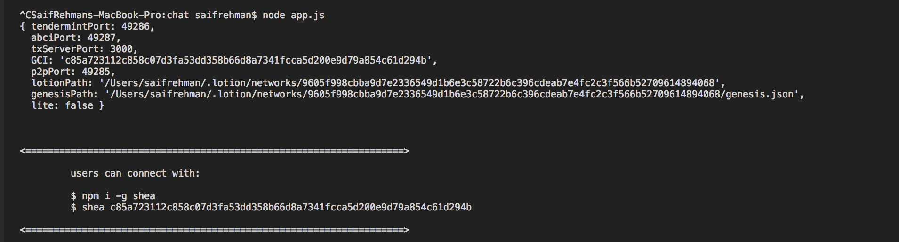
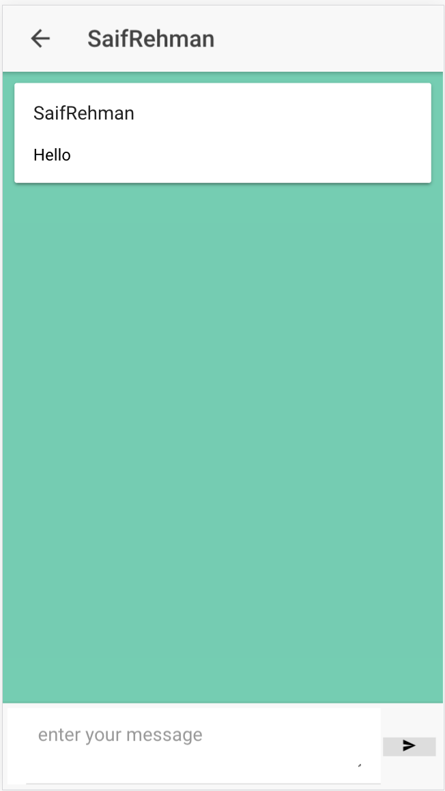

## Tendermint Blockchain Chat App


This is minimal chat application based on Tendermint Blockchain using Lotionjs in 30 lines of code!. It also includes web/mobile application built using Ionic 3.

### Running the blockchain
1. Install dependencies 
``` npm i ```
2. Run the Blockchain
``` node app.js ```



Your tendermint port is 46667, and your blockchain server port is 3000

3. Endpoint: http://localhost:3000/state (GET), shows current data in blockchain
4. Endpoint: http://localhost:3000/txs (POST), post new data in blockchain


End points available through ABCI (Application blockchain interface) :)

5. How simple?

## Run FrontEnd Mobile Application
1. Navigate to frontend dir
```
cd frontend
```
2. Install dependencies
```
npm i
```
3. Install ionic cli 
```
npm -g ionic cordova
```
4. Run the app
```
ionic serve
```

## Screenshot of App





