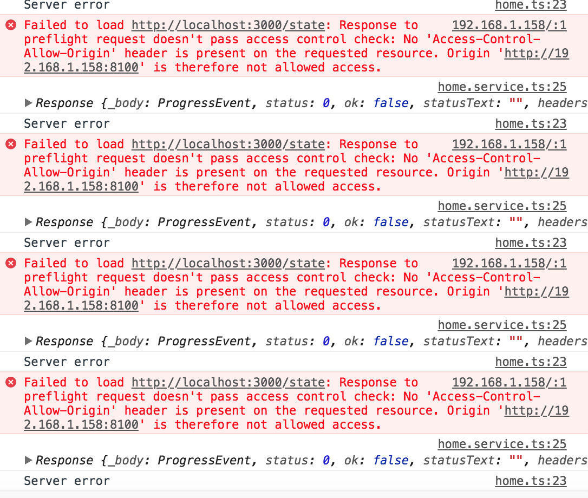
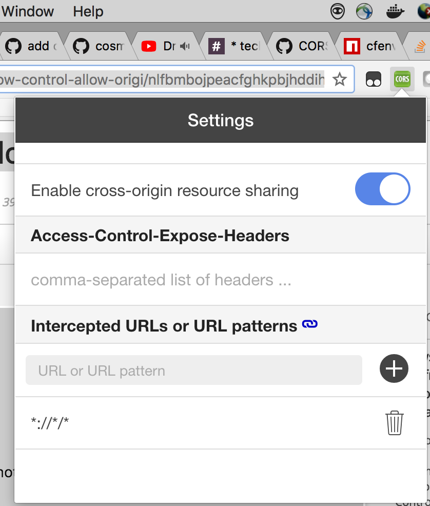

## Tendermint Blockchain Chat App


This is minimal chat application based on Tendermint Consensus Engine using Lotionjs in 30 lines of code!. It also includes web/mobile application built using Ionic 3.

### Running the blockchain
1. Install Tendermint
```
$ go get -u github.com/tendermint/tendermint/cmd/tendermint
```
2. Navigate to blockchain dir 
```
$ cd blockchain
```
3. Install dependencies 
```
$ npm i 
```
4. Run the Blockchain
``` 
$ node app.js
```


Your tendermint port is 46667, and your blockchain server port is 3000

1. Endpoint: http://localhost:3000/state (GET), shows current data in blockchain
2. Endpoint: http://localhost:3000/txs (POST), post new data in blockchain
3. Endpoint: http://localhost:46657/ , access available Apis provided by Tendermint RPC 


End points available through ABCI (Application blockchain interface) :)

How simple can that be?

## Run FrontEnd Mobile Application
1. Navigate to frontend dir
```
$ cd frontend
```
2. Install dependencies
```
$ npm i
```
3. Install ionic cli 
```
$ npm i -g ionic cordova
```
4. Run the app
```
$ ionic serve
```
5. App running on port 8100
```
http://localhost:8100
```
## CORS Issue Fix 
If you face error as such 


1. Install "Allow-Control-Allow-Origin: *" plugin of google chrome to enable CORS

link: [Allow-Control-Allow-Origin: *](https://chrome.google.com/webstore/detail/allow-control-allow-origi/nlfbmbojpeacfghkpbjhddihlkkiljbi?hl=en)

2. Enable CORS 


## Screenshot of App


